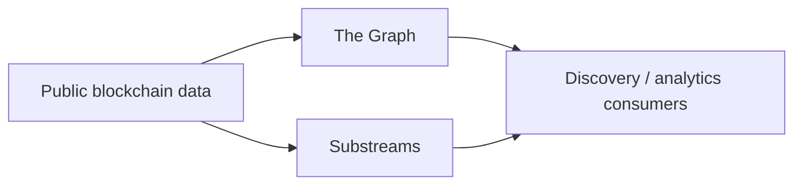

# Architecture


## Solver discovery and execution

```mermaid
flowchart LR
    A[Solver / Wallet / Intent Framework] --> B[Onchain Discovery Facade]
    A --> C[/.well-known/nexa-solver.json]
    B --> C
    C --> D[Signed Feed]
    D --> E[Execution Permit]
    E --> F[Router.fillDirect]
    F --> G[SourceFillV6]

    H[Registry / Router onchain state] --> B
    H --> I[Graph / Substreams]
    G --> I

    I -. discovery only .-> A
```

The authority chain is intentionally narrow:

1. **Onchain Registry / Router** establish protocol identity and onchain state.
2. **Signed Feed** is authoritative for current live route terms.
3. **Execution Permit** is the final execution authority.

Passive indexers and analytics systems are never execution authorities.

## Public discovery surfaces

```mermaid
flowchart TB
    S[solver.vsnexa.com] --> W1[/.well-known/nexa-solver.json]
    S --> W2[/.well-known/nexa-onchain-discovery.json]
    S --> W3[/.well-known/nexa-standards.json]
    S --> O[/openapi.json]
    S --> F[/api/v6/solver-feed]

    W1 --> R[Solver integration]
    W2 --> X[Scanners / explorers / indexers]
    W3 --> T[ERC-7683 / OIF discovery]
    O --> R
    F --> R
```

## Passive indexing



## Networks

| Network | Chain ID | Public indexing |
| --- | ---: | --- |
| Base | 8453 | Graph + Substreams |
| BNB Smart Chain | 56 | Graph + Substreams |
| HyperEVM | 999 | Substreams |

## Execution invariant

The public integration does not add intermediary execution transactions. The documented execution invariant remains:

**1 Bot source transaction + 1 Nexa destination transaction = 2 onchain transactions.**

## Public artifacts

- [Canonical integration bundle](../nexa-mainnet-v6.json)
- [Solver-facing ABI](../abi/solver-facing.json)
- [OpenAPI](../openapi/openapi.json)
- [Standards](../standards/nexa-standards.json)
- [Passive indexing package](../indexing/README.md)
- [Verification evidence](../verification)
